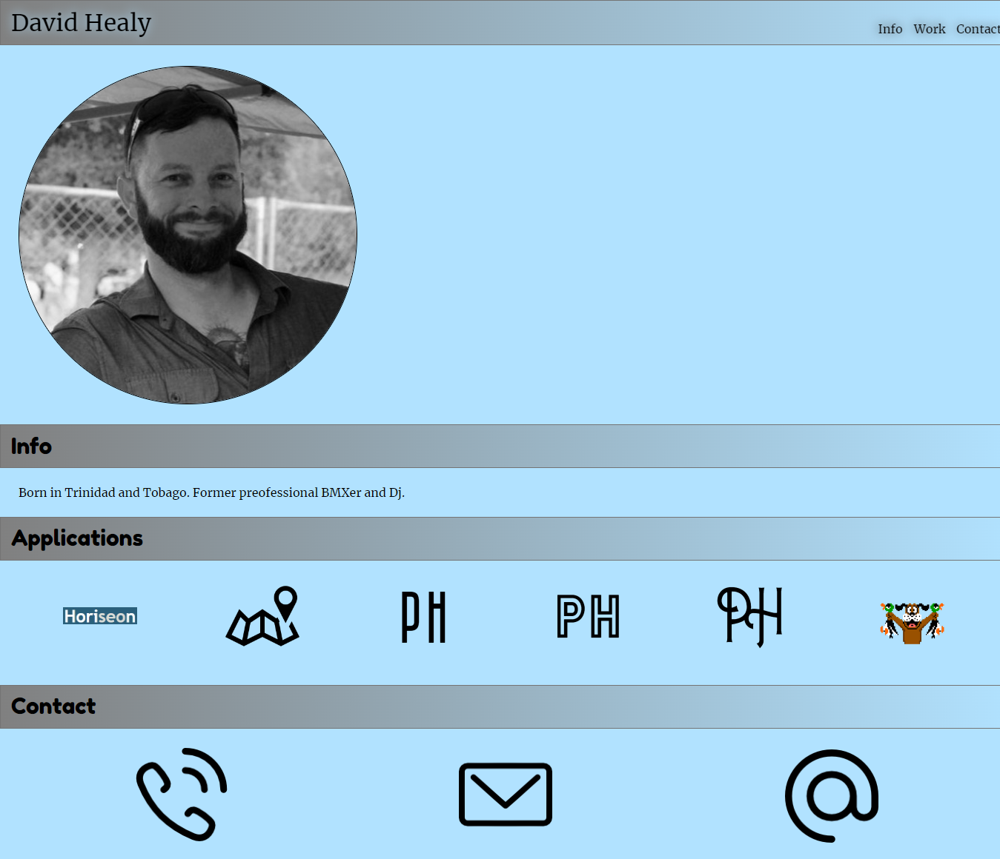

# David Healy's Portfolio

## Discription

This is a landing page for David Healy's portfolio. Here you will see some basin information on him an his background. In addition there is a link to a webpage he has refactored and some additional "PH" icons as place holders.

- I wanted to make my first portfolio.
- This project pushed me to understand what it would take to make this type ofe page.
- It make navigation the page easy on a computer or a handheld device.
- I learned how to place my icons centered inline when all images didn't have the same hight and width. I also learned how to make my contact icons redirect to your phone, preferred email handler, how to link it to my LinkedIn URL.

## URL Directory
(https://dhealy83.github.io/week-2-challenge/)

## Usage

- The navigation bar on the top right of the page allows you to be directed to its corresponding section.
- You can click on icons in the "Applications" section to navigate to my current work. Maps icon and the four others are place holders and do not currently redirect you anywhere.
- Click the phone icon to be redirected to your phone so you can call me.
Click the email icon to have you default email handler open an email to send to me.
-Click the @ info to be redirect to my LinkedIn page.

